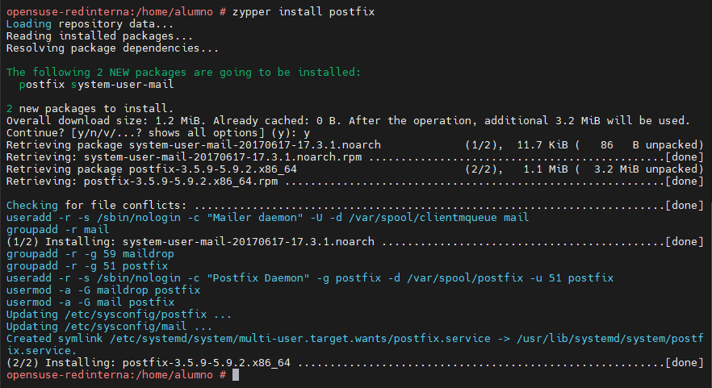
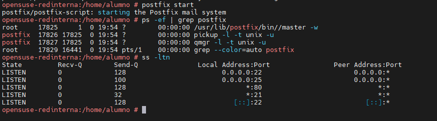
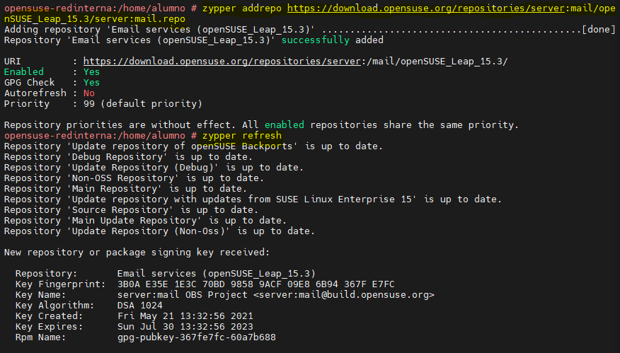
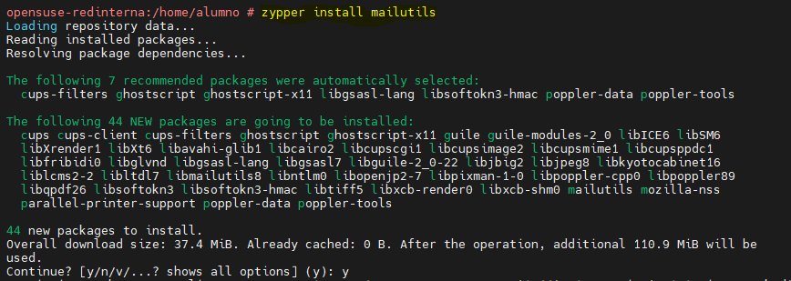
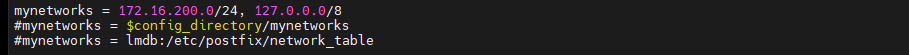
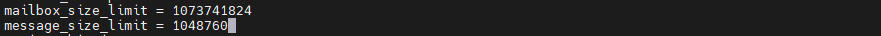
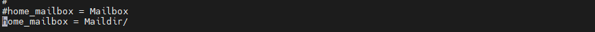
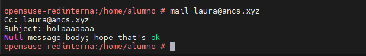
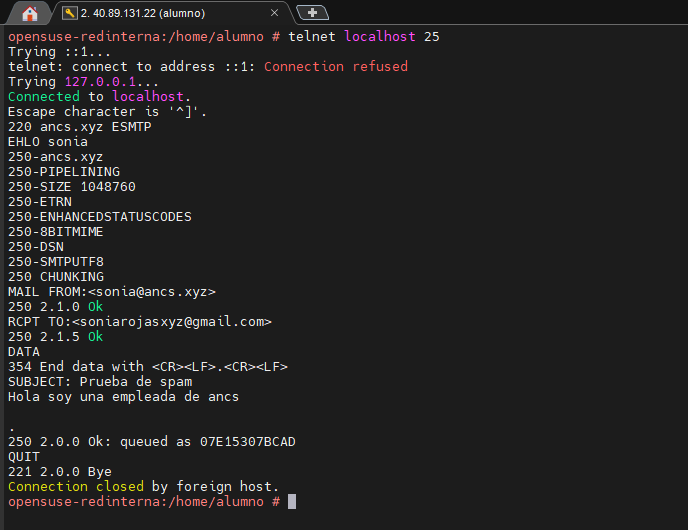
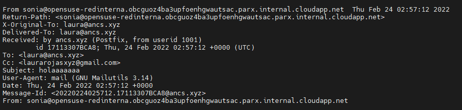

SERVIDOR DE CORREO EN OPENSUSE

Instalación del servicio de correo

Iniciación del sistema y comprobación de funcionamiento

Instalamos el cliente mailutils

## Fichero de configuración Postfix

Hacemos una copia de seguridad y procedemos con la configuración

Establecemos el nombre de dominio

Proveerá a los usuarios de la red interna

El tamaño máximo de envío de mensajes

El formato del buzón

Funcionamiento de envíos de manera local

Creamos la usuaria Laura, le enviamos un mail y consultamos el log

Comprobamos su home para ver el log

