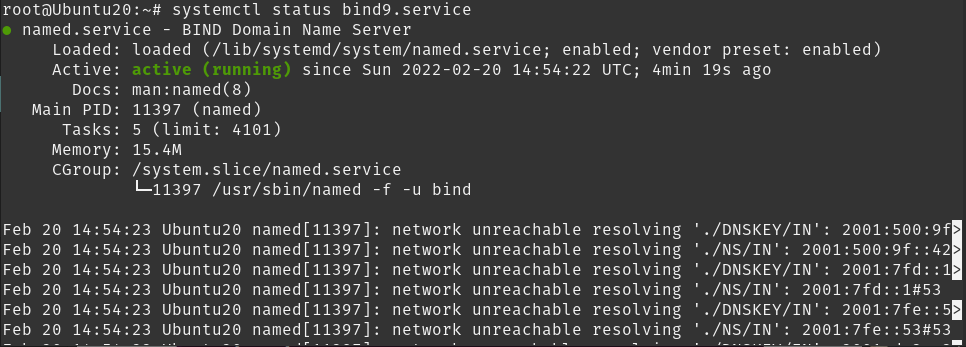

## DNS en Azure.

En la máquina Ubuntu de Azure se instalará un servidor DNS primario, que resolverá consultas DNS de forma directa y reversa. Para ello se debe seguir los siguientes pasos:

1. /etc/resolv.conf
2. Instalar bind9.
3. Modificar ficheros de configuración.
4. Crear ficheros de zona de resolución directa e indirecta.
5. Probar la configuración.

## 1. Configurar /etc/resolv.conf.

Debemos configurar antes este fichero para poder realizar las consultas. Sustituimos la dirección 127.0.0.53 que viene por defecto en el Ubuntu y ponemos la dirección de localhost para que el propio servidor haga realice las consultas.

## 2. Instalación del bind9.

Se debe actualizar primero las librerías del sistema y luego instalar servicio con `apt-get install`

Se instala el bind9:

Para comprobar que el servicio ya funciona hay que observar que el bind9 está corriendo.

Y observar que los puertos del DNS estén escuchando.

Ahora que el servicio funciona ya se pueden modificar los ficheros de configuración del servidor.

## 3. Modificar los ficheros de configuración.

El primer fichero a modificar será `/etc/bind/named.conf.local`, antes de realizar una configuración hay que hacer una copia de seguridad. 

En estas líneas de configuración se debe especificar los ficheros de zona. Estos ficheros los usará el servidor para cuando reciba peticiones DNS y este usará estos archivos para resolverlos, de forma directa e inversa.

Luego haremos mismo con `/etc/bind/named.conf.options`, en él se se especifica que en la línea de forwarders se usen los servidores de Google para respoder a cosultas DNS.

## 4. Crear ficheros de zona de resolución directa e indirecta.

Vamos a crear los siguientes ficheros en los que he especificado en el fichero named.conf.local:

- Crear y configurar el fichero de resolución directa: db.ancs.xyz.

Aquí en el fichero se debe indicar 

Este será el fichero resultado. Le asignamos aquí al nombre de www.ancs.xyz a la IP pública de nuestro servidor como registro A

- Crear y configurar el fichero de resolución inversa: db.20.47.80.

Para la resolución inversa funciona de forma similar, esta tenemos que asociar la IP con el nombre.

## 5. Probar la configuración.

Para probar la configuración podemos probar con nslookup, host o dig como comandos. De forma local. 

Primero vamos a probar con la resolución directa.

- host.

  

- nslookup.

  

  

  Y ahora con la resolución inversa, que resolverá la dirección IP, y nos responderá la consulta con el servidor DNS asociado.

  - host.

  

  - nslookup.

    

  

  

  

