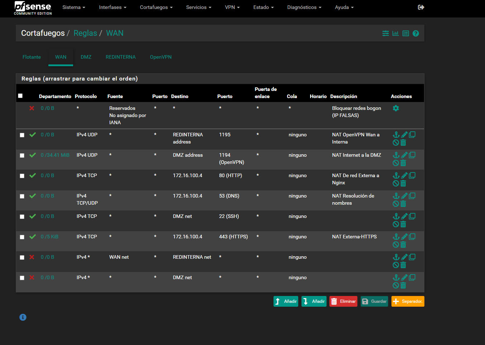
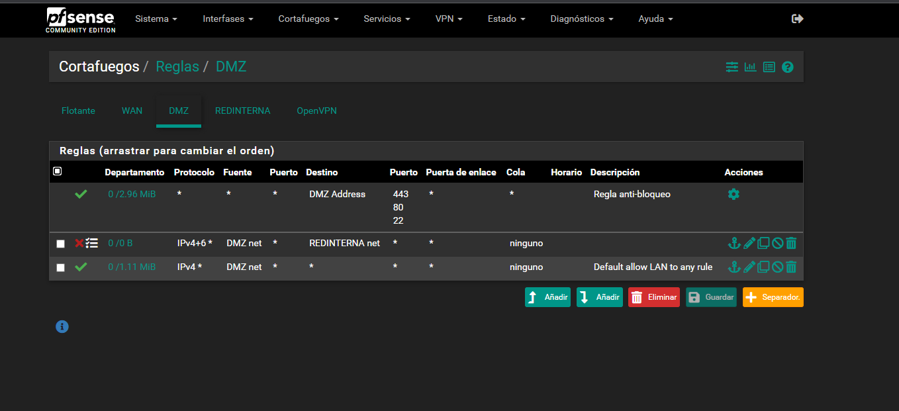
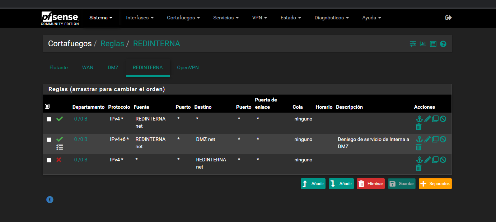
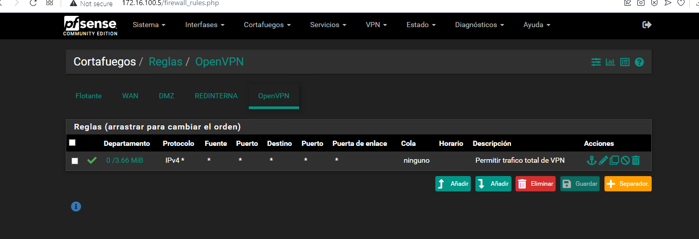
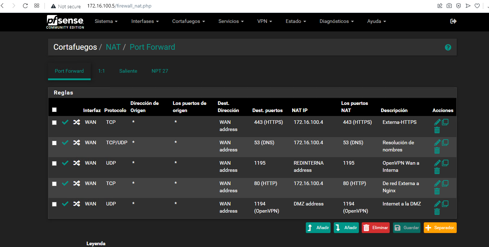

###### Reto Game of Networks

## Reglas de FireWall y NAT

#### 1. Empezando con FireWall Rules:

Reglas de Firewall de la WAN hacia la DMZ

Reglas de Firewall de la DMZ, en este caso permitimos todo el tráfico para que podamos realizar las pruebas del dmz:

Reglas de Firewall de la RedInterna:

Y dentro de la OpenVpn permitimos el tráfico total:

Reglas de Nateo para la OpenVPN:

