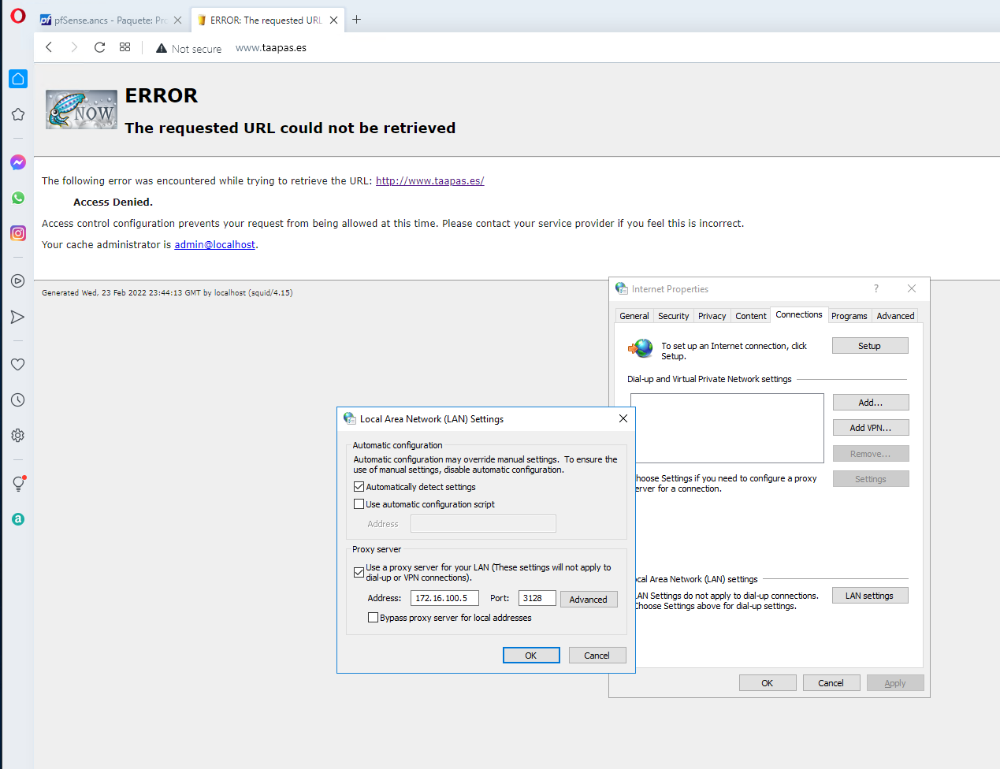

###### Reto Game of Networks

## Creación de Proxy en PFSENSE

#### Entrega de: *Denis Alexander Gutiérrez Salvador*

#### 1. Empezando con PFSENSE:

Instalamos "Squid":

Vamos a "Gerente de Empaquetación" y buscamos "squid":

Luego de instalarlo, vamos a "Services" y buscamos "Squid Proxy Server":

Le damos a "Check to enable the Squid proxy" y seleccionamos la interfaz donde va a actuar, en nuestro caso es "DMZ":

Habilitamos el log:

Primero vamos a acceder a "www.taapas.es" para luego bloquearlo:

Vamos a probarlo, bloqueando el acceso a "www.taapas.es", para ello vamos a "Blacklist":

Y le damos a "guardar":

Vamos a "Internet Properties" y ponemos nuestro proxy y el puerto:

