Instalación Servidor SSH en OpenSuse (Red Interna) 

Máquina servidora: OpenSuse. IP 172.16.200.2

Comenzamos ejecutando un sudo zipper update. En OpenSuse el comando zypper sustituye al apt o apt-get.

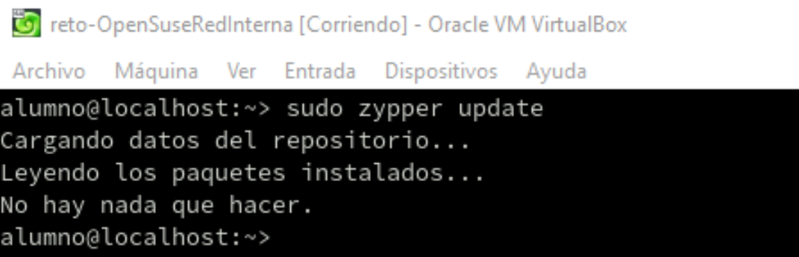

Instalo el servidor ssh.

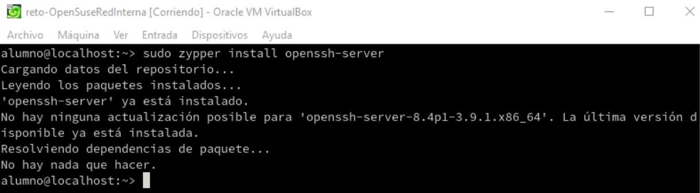

CONFIGURACIÓN SERVIDOR SSH.

El firewall bloquea las conexiones ssh del puerto 22.

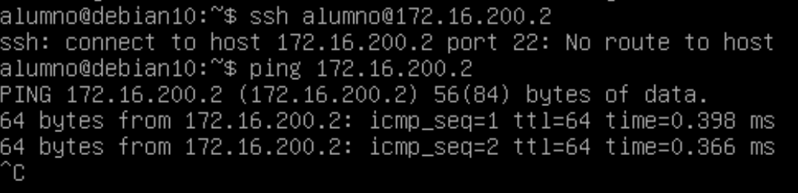

Abro el puerto 22 del firewall en el servidor

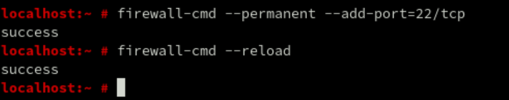

La conexión funciona desde el cliente.

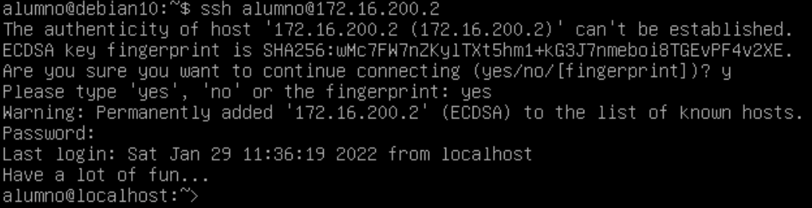

Habilito el puerto 22.

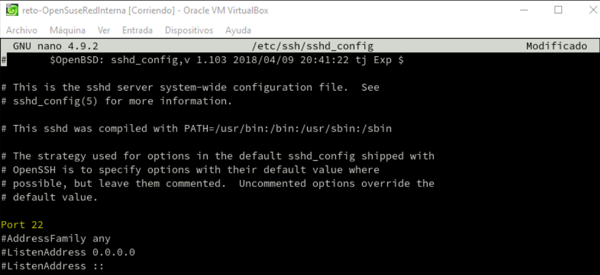

Deniego el acceso por root y lo compruebo.

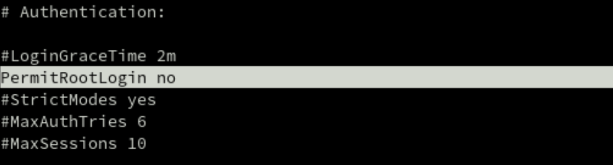

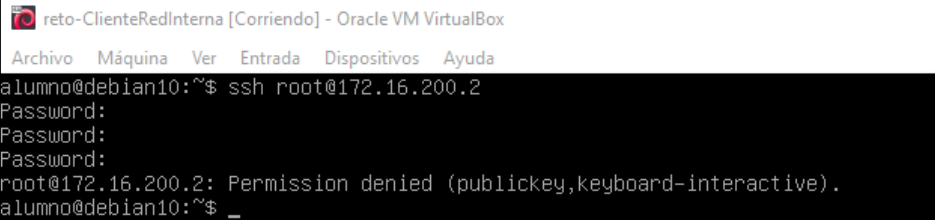

Configuración del tiempo de espera por inactividad (180 segundos) y número máximo de intentos de autentificación (3 intentos)

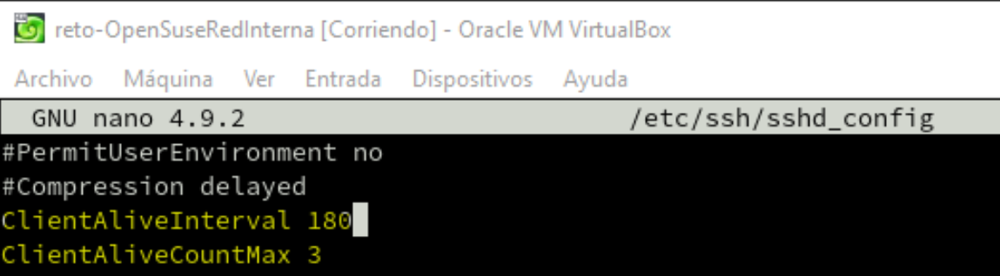

Número máximo de conexiones abiertas sin autenticar (1 como máximo).

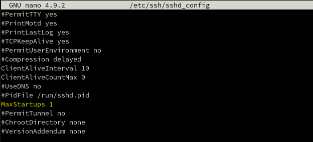

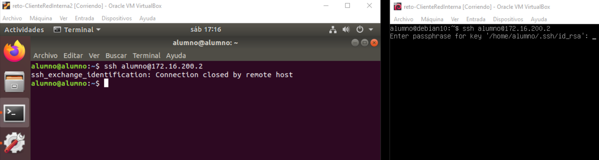

Guardo los cambios y reinicio el servidor con "sudo rcsshd restart"

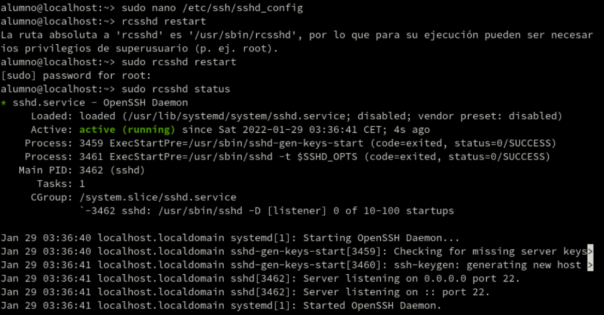

Autenticación por clave pública.

Creo el directorio y el fichero que almacenará las claves públicas de los clientes. /.ssh/authorized_keys

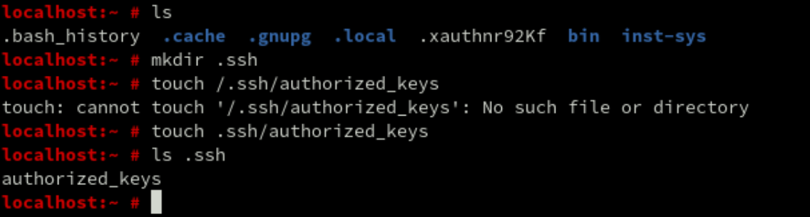

Genero un par de claves en el cliente y copio la clave pública generada al servidor.

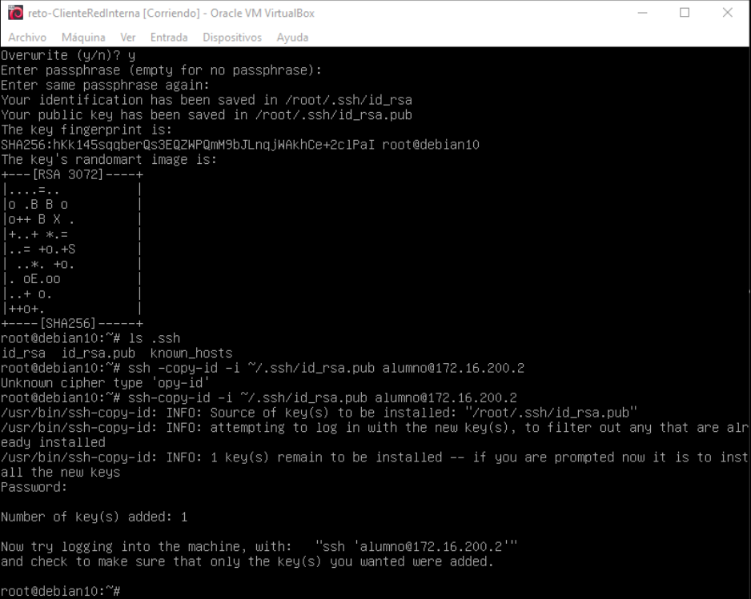

Introducimos la frase de paso y me conecto.

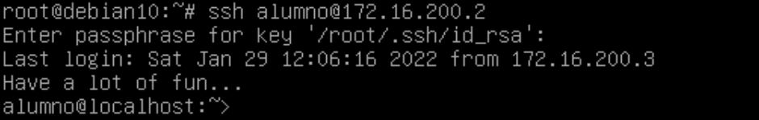

Revisamos el fichero authorized_keys y vemos las claves públicas de alumno y root (del cliente debian).

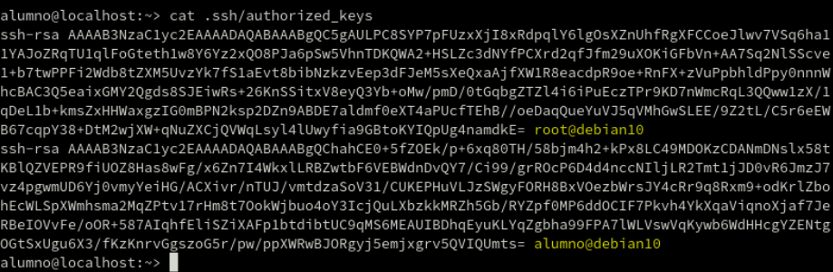

También deshabilito la autenticación por contraseña para obligar que se identifiquen por clave pública.

**Servicio de conexión SFTP**

Instalo el servidor SFTP.

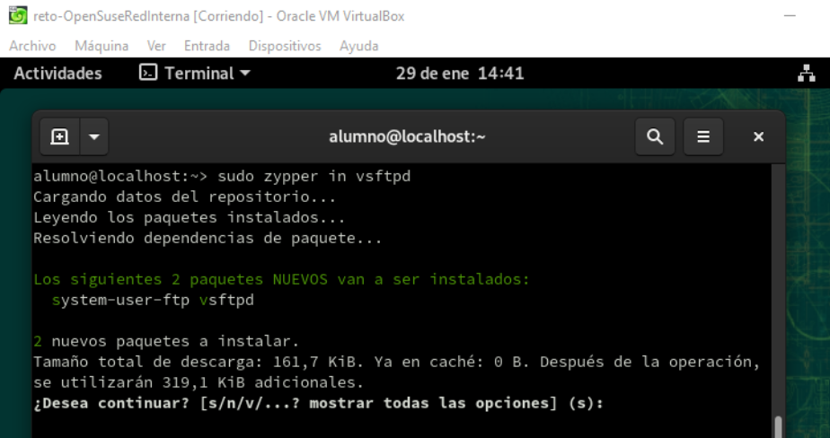

Lo habilito para que inicie cuando encienda la máquina.

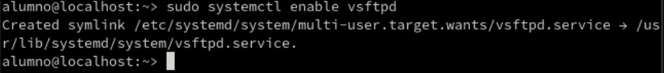

Compruebo la conexión.

Configuración del banner.

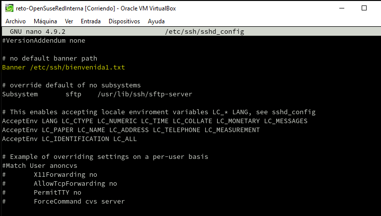

Previamente hay que crear el fichero de bienvenida. El banner funciona correctamente.

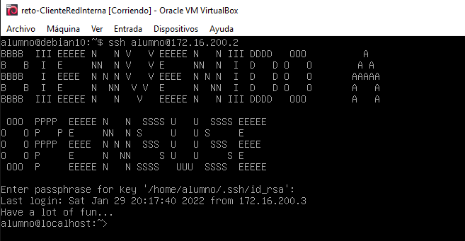