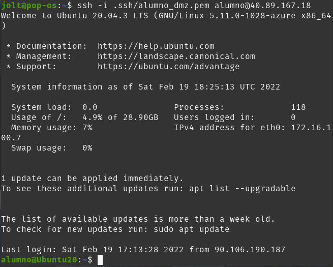
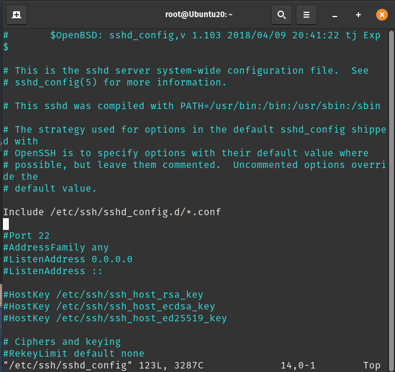
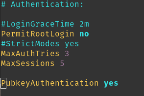
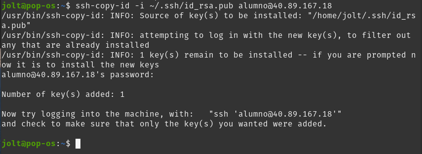
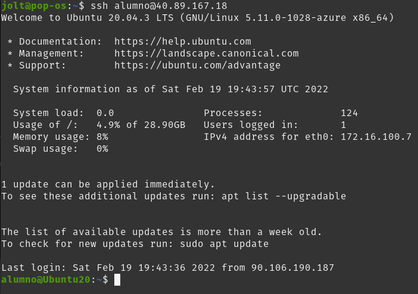
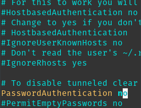
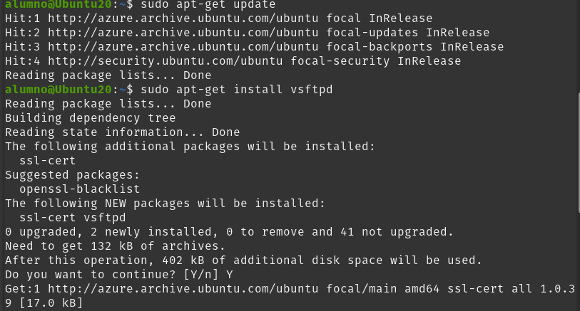

## Servidor SSH en Azure, servidor de la red DMZ.

La máquina del servidor DMZ, está ahora disponible en Azure, pero solo se puede conectar por clave privada de la máquina. Para ello se debe realizar una serie de configuraciones:



- Configurar el servidor para que acepte autenticación con claves públicas.
- Crear un par de claves para acceder con clave pública al servidor.
- Poner un límite de sesiones y de intentos de autenticación.
- Prohibir acceso con Root a la máquina.
- Quitar autenticación con contraseña.

Se accede con root al fichero de configuración /etc/ssh/sshd_config. En éste fichero se debe realizar la mayoría de configuraciones posibles del servidor SSH.



En estas cuatro líneas están:

````shell
- PermitRootLogin: al cual se debe poner como "no", para prohibir accesos como root en la máquina.
- MaxAuthTries: El máximo de intentos de autentificación será 3
- MaxSessions: El máximo de sesiones activas será 5
- PubkeytAuthentication: En "yes" para que el servidor accepte claves públicas de los clientes.
````



Tras esto se reinicia el servidor para aplicar los cambios y comprobar que no se puede acceder con Root.


Después de esto hay que crear un par de claves en la máquina cliente para obtener una clave pública en la cual el cliente pueda acceder al servidor. El passphrase será "`alumno`"


Después desde el cliente se mandará la clave pública al servidor para que autorice la clave pública recién generada y se pueda acceder a éste sin necesidad de contraseña. El comando para llevarlo acabo será el siguiente:

`ssh-copy-id -i ~/.ssh/clavepublica.pub usuario@IPdelservidor`

Para la introducción de la clave pública en fichero authorized_keys se debe poner la contraseña del servidor. Una vez hecho se introducirá.



La salida del comando indicará que se intente conectar al servidor por medio del comando

`ssh usuario@IPdelservidor`.

Después de esto no debería pedir ningún tipo de contraseña.



Ya dentro del servidor de nuevo se debe modificar de nuevo la configuración del servidor SSH y añadir no a la directiva de PasswordAuthentication. Así se quedará deshabilitada la autenticación por contraseña.



Y finalmente se debe modificar las siguientes directivas. 

````shell
- ClientAliveInterval 180. Es el máximo de segundos que un cliente puede estar inactivo en la conexión, cada intervalo de segundos mandará un mensaje al cliente para comprobar su actividad.
- ClientAliveCountMax 3. El máximo de mensajes enviados por el servidor para comprobar si sigue activo en el servidor.
- MaxStartups 3. El máximo conexiones sin autenticar tratando de entrar al servidor.
````


### Instalación del vsftpd.

Hay que actualizar los paquetes de la máquina ubuntu y luego instalar vsftpd.

